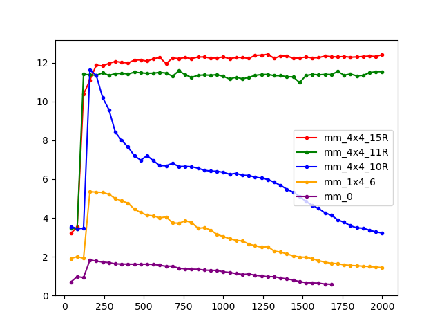
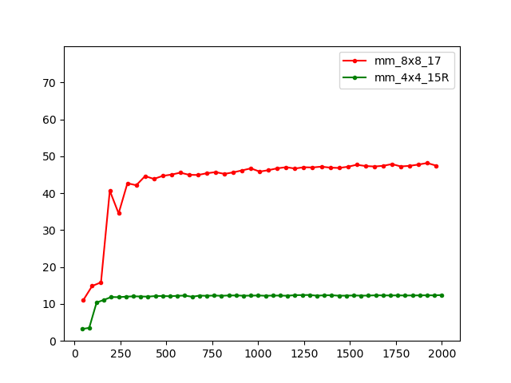

# **Notes on *How-to-Optimize-GeMM***

## 一些说明

### 关于本文

本文为教程 [flame/how-to-optimize-gemm](https://github.com/flame/how-to-optimize-gemm) 的学习笔记, 该教程介绍了针对单核 CPU 上的 GeMM (General Matrix Multiply) 计算优化的若干方法. 最后笔者借鉴其思路, 使用 `AVX512` 重写该程序以获得更高性能.

### 实验环境

- **CPU**: `Intel Xeon Gold 6240` (Cascade Lake 架构) .
- **Compiler**: 开启 `-O2` 优化的 `GCC 7.5.0`.
- **OS**: `Ubuntu 18.04`.

### 关于矩阵

在本文的语境中:

1. A、B 和 C 对应于矩阵乘法 $C :=AB $ 中的三个矩阵, 其中 C 为结果矩阵.
2. A、B 和 C 三个矩阵的行数和列数均是 8 的倍数. 记 A 的行数为 `m`、列数为 `k`,  B 的行数为 `k`、列数为 `n`.
3. 矩阵以 ｢列优先｣ 的方式进行存储. 

> 列优先: 比如当 `m = k = n = 3` 时, 内存序列 `[1, 2, 3, 40, 50, 60, 7, 8, 9]` 对应于矩阵:
> $$
> \begin{pmatrix}
> 1 & 40 & 7 \\
> 2 & 50 & 8 \\
> 3 & 60 & 9 \\
> \end{pmatrix}
> $$
> 而为了与 ｢先行后列｣ 的习惯相一致, 这里通过宏定义完成:
>
> ```C
> #define A(i, j) a[(j)*lda + (i)]
> #define B(i, j) b[(j)*ldb + (i)]
> #define C(i, j) c[(j)*ldc + (i)]
> ```
>
> 其中 `ldx` 表示矩阵 X 相邻两列首元素间的跨度 (**ld** 是 **l**eading-**d**imension 的缩写, 理解成 **l**ai**d**out 似乎也行). 
> 因此同一列的元素间距为 `1`, 而同一行的元素间则内存不连续, 其跨度为 `ldx`. 这与 C 语言的一般习惯可能不同.
>另外如果矩阵 X 有 `h` 行, 则 `ldx` 必须大于等于 `h`.

### 原始程序

未经优化的 GeMM 程序如下所示, 外面两层循环遍历 C 的每一个 (i, j) 位置, 最内层循环计算相应的内积.

```C
for (i = 0; i < m; i++) {     /* Loop over the rows of C */
   for (j = 0; j < n; j++) {     /* Loop over the columns of C */
      for (p = 0; p < k; p++) {     /* A 的第 i 行和 B 的第 j 列内积得到 C(i, j)*/
         C(i, j) += A(i, p) * B(p, j);	
      }
   }
}
```

### 准备工作

将 ｢一个行向量和另一个列向量的内积运算｣ 封装为 `AddDot` 函数:

```C
void AddDot(int len, double* x, int incx, double* y, double* gamma) {
    #define X(i) x[i * incx]	    /* 行向量 x 的第 i 个元素 */
    for (int p = 0; p < len; p++) {
        *gamma += X(p) * y[p];
    }   
}
```

交换外面两层循环的次序, 使得先遍历 C 的第 0 列的每一行, 再遍历第 1 列的每一行, 以此类推.

```C
for (j = 0; j < n; j++) {
	for (i = 0; i < m; i++) { 
        AddDot(k, &A(i, 0), lda, &B(0, j), &C(i, j));
    }
}
```

准备工作完成后, 性能几乎不变.

> 关于第二个改动为何不会提升 ｢矩阵规模较大时｣ 的性能 (这里的想法是: 这一改动会使得相邻的 `AddDot` 调用的 `&B(0, j)` 一整列元素都可以命中 Cache. 而在矩阵规模很大时, 优化前的程序并不能保证这一点.) 猜测其原因在于: 由于对 B 的访问是内存连续的, 因此即使这一列没有缓存在 Cache 中, 硬件 Prefetch 机制也可以避免除第一个元素外的 Cache miss.

### 行文逻辑

在 ｢准备工作｣ 的基础上, 原教程依次介绍了两个版本: 

- 第一个版本称为 `1x4` 的, 每次计算矩阵 C 的大小为 1×4 的块.
  介绍了循环展开、访存优化、缓存变量于寄存器、优化内存索引等技巧. 
- 第二个版本称为 `4x4` 的, 每次计算矩阵 C 的 4×4 共 16 个元素.
  额外介绍了基于 SIMD 指令的并行计算, 以及矩阵分块和内存打包的技巧.

本文会按照原教程的顺序介绍这两个版本中涉及的优化方法, 最后介绍笔者进一步使用 `AVX512` 进行改写的方法.


## `1x4` 版本

### 循环展开

这一优化对最外层循环进行了步长为 4 的 ｢循环展开｣:

```C
for (j = 0; j < n; j += 4) {
    for (i = 0; i < m; i += 1) {
        AddDot(k, &A(i, 0), lda, &B(0, j), &C(i, j));	        // C(i, j)
        AddDot(k, &A(i, 0), lda, &B(0, j + 1), &C(i, j + 1));	// C(i, j + 1)
        AddDot(k, &A(i, 0), lda, &B(0, j + 2), &C(i, j + 2));	// C(i, j + 2)
        AddDot(k, &A(i, 0), lda, &B(0, j + 3), &C(i, j + 3));	// C(i, j + 3)
    }
}
```

｢循环展开｣ 有以下两个好处:

1. 减少了循环本身的开销 (`j < n` 的判断以及 `j` 的更新只有原来的 1/4).
2. 可以暴露相邻迭代间的变量间关系, 为进一步优化创造可能.

进一步将循环内的四行进行封装为 `AddDot1x4(•)` 函数调用:

```C
void AddDot1x4(int k, double* a, int lda,
                      double* b, int ldb,
                      double* c, int ldc) {
    // 计算矩阵 C 的 C(0, 0), C(0, 1), C(0, 2) 和 C(0, 3) 四个元素.
    // 注意到在调用这个例程时, 实际传入的 c 是 C(i, j) 的地址,
    // 因此此时计算的是原矩阵的 C(i, j), C(i, j + 1), C(i, j + 2) 和 C(i, j + 3).
    AddDot(k, &A(0, 0), lda, &B(0, 0), &C(0, 0));
    AddDot(k, &A(0, 0), lda, &B(0, 1), &C(0, 1));
    AddDot(k, &A(0, 0), lda, &B(0, 2), &C(0, 2));
    AddDot(k, &A(0, 0), lda, &B(0, 3), &C(0, 3));
}
```

这样原来的双重循环变为:

```C
for (j = 0; j < n; j += 4) {   
    for (i = 0; i < m; i += 1) {   
        AddDot1x4(k, &A(i, 0), lda, &B(0, j), ldb, &C(i, j), ldc);	// 更新 C(i, j) ... C(i, j + 3) 四个元素
    }
}
```

### 函数内联与循环合并

将 `AddDot()` 函数调用 (本质上就是个 `for` 循环) 内联到 `AddDot1x4` 中, 然后将这 4 个 `for` 循环合并, 得到:

```C
void AddDot1x4(int k, double* a, int lda,
                      double* b, int ldb,
                      double* c, int ldc) {
    for (int p = 0; p < k; p++) {
        C(0, 0) += A(0, p) * B(p, 0);
        C(0, 1) += A(0, p) * B(p, 1);
        C(0, 2) += A(0, p) * B(p, 2);
        C(0, 3) += A(0, p) * B(p, 3);
    }
}
```

这一优化在 ｢矩阵规模较大时｣ 有明显的性能提升.
这是因为当 `L2 Cache` 不足以缓存这些矩阵时, 之前的四次 `for` 循环中, 每次访问 `A(0, p)` 都缓存不命中, 因此涉及 `4 * k` 次 `DRAM` 访问; 而现在的每轮循环中, 第二三四行对 `A(0, p)` 的访问都会命中缓存.

### 缓存到寄存器

在上一节中, 矩阵 A 和矩阵 C 通过大量命中 Cache 获得很高的效率, 但 Cache 毕竟没有寄存器快.
考虑将 `C(0, 0)` 到 `C(0, 3)`, 以及 `A(0, p)` 显式地赋给变量, 期待编译器将它们对应于 5 个物理寄存器:

```C
void AddDot1x4(int k, double* a, int lda, double* b, int ldb, double* c, int ldc) {
    register double 
        c_00_reg = 0.0, c_01_reg = 0.0, c_02_reg = 0.0, c_03_reg = 0.0, a_0p_reg; 
    for (int p = 0; p < k; p++) {	  // 在寄存器中累加
        a_0p_reg = A(0, p);
        c_00_reg += a_0p_reg * B(p, 0);
        c_01_reg += a_0p_reg * B(p, 1);
        c_02_reg += a_0p_reg * B(p, 2);
        c_03_reg += a_0p_reg * B(p, 3);
    }
    C(0, 0) += c_00_reg;			// 最后统一写回
    C(0, 1) += c_01_reg;
    C(0, 2) += c_02_reg;
    C(0, 3) += c_03_reg;
}
```

> 为什么编译器不能自动进行这一优化? 
>
> - 首先是 Pointer Aliasing 的问题: 编译器担心 `*a` `*b` 和 `*c` 指向的内存区域存在重叠, 从而让这一优化改变程序行为. 
>
> - 当然事实上是不存在这个问题的. 为此可以使用 `restrict` 关键字修饰指针, 显式地告知编译器可以放心优化. 
>
>   经过实测, 此时编译器就会自动为 `A(0, p)` 分配寄存器.
>
> - 然而对 `C(0, i)` (i = 0, 1, 2, 3) 的访问仍然是每次都读写内存, 而没有分配寄存器.
>   关于这个优化为何不能自动进行, 起初猜测是因为编译器认为浮点数不满足结合律. 但即使开了 `-Ofast` 仍然不行, 疑惑中.

### 矩阵索引优化

目前在循环中对 B 的访问形如:

```C
for ... {
    B(p, 0);
    B(p, 1);
    B(p, 2);
    B(p, 3);
}
```

可以对它进行如下两个优化:

#### 优化 1: 用指针索引

首先在循环体外获取 B 的四个列的指针:

```C
double 
    *b_p0_ptr = &B(0, 0),   *b_p1_ptr = &B(0, 1),   *b_p2_ptr = &B(0, 2),   *b_p3_ptr = &B(0, 3);
```

由于每次循环都是访问相邻的下一行的四个元素, 因此对 B 的索引可以写为:

```C
for ... {
    (*(b_p0_ptr++));
    (*(b_p1_ptr++));
    (*(b_p2_ptr++));
    (*(b_p3_ptr++));
}
```

#### 优化 2: 间接寻址

目前每一轮 `for` 循环中涉及 4 次指针解引用, 以及 4 次指针的更新 (至少 C 语言字面上如此). 
下面使用循环展开的技巧, 使得指针更新次数变为原来的 1/4. 

事实上, 在循环展开后, 每个指针的 4 次 `*(ptr++)` 可以合并为 `*(ptr+0), *(ptr+1), *(ptr+2), *(ptr+3), ptr+=4`, 
这样从原来的 ｢4 次解引用 + 4 次指针更新｣ 优化为了 ｢4 次解引用 + 1 次指针更新｣. 
其中 `*(ptr + i)` 的解引用方式称为 ｢间接寻址｣ (Indirect Addressing).

> 原文通过这两个优化获得了性能提升, 我实测则性能不变. 考察汇编代码也几乎不变, 应该是编译器自动进行了优化.
>
> 
> 
> 上图中 7 对应【优化 1: 用指针索引】,  8 对应【优化 2: 间接寻址】

### 版本总结

在这一版本涉及的所有优化中, 有两个带来了显著性能提升, 分别是 ｢循环合并｣ 和 ｢缓存到寄存器｣. 

- 前者通过融合 4 个循环的循环体, 提高了 Cache 的命中率; 
- 后者则进一步将对 Cache 的读写优化为了对寄存器的读写.

这两个优化带来的性能提升如图所示:


- 绿线对应的 ｢循环合并｣ 优化在矩阵尺度较大时带来了显著的性能提升;
- 红线对应的 ｢缓存到寄存器｣ 优化则带来了整体的性能提升.

> 关于图中纵轴 (单位: GFLOPS) 的最大值, 其为当前硬件的理论性能上限. 
> 需要指出: 这里并非通过理论计算得出, 而是基于 [pigirons/cpufp](https://github.com/pigirons/cpufp) 工具测试得出. 关于它的讨论见下一节.


## `4x4` 版本

### 关于 SSE

原教程中说:

1. 按 `4x4` 的块进行运算, 是为了更好地利用 `SSE3` 指令进行并行计算;
2. `SSE3` 中存在一些指令, 允许在每个时钟周期内进行 2 次乘法和 2 次加法.

其中第二条的原文是:

> There are special instructions as part of the SSE3 instruction set that allow one to perform two 'multiply accumulate' operations (two multiplies and two adds) per clock cycle for a total of four floating point operations per clock cycle.

笔者认为它**并非**指代 `FMA` (乘加融合指令), 而是在说: 操作数为 128 位 `%xmm` 寄存器的 `addpd` 和 `mulpd` 汇编指令 (相应的 Intrinsic 是 `__m128d _mm_add_pd (__m128d a, __m128d b)` 和 `__m128d _mm_mul_pd (__m128d a, __m128d b)`) 的 CPI 为 0.5, 因此在没有数据依赖的时候, 两个指令可以在同一个周期内同时执行. 

### 硬件性能: 理论与实测

笔者使用了 `cpufp` 工具来测量所用硬件 (在不同指令集下的) 的峰值 FLOPS.
考察这一工具的源码可以窥见其原理 ([参考这篇文章](https://zhuanlan.zhihu.com/p/28226956)):

- 对于 `sse` 的测试, 它使用无数据依赖的 `addpd %xmmA, %xmmA` 和 `mulpd %xmmB, %xmmB` 交替执行, 此时这两个指令可以合并在一个周期执行, 每个周期进行 2 次加法和 2 次乘法, 共 4 次浮点运算.
- 对于 `avx` 的测试, 它使用无数据依赖的 `vaddpd %ymmA, %ymmA, %ymmB` 和 `vmulpd %ymmA, %ymmA, %ymmC` 交替执行. 这和 `sse` 测试中同理, 但这里寄存器从 `%xmm` 变为 `%ymm`, 长度翻倍了, 因此每个周期的浮点运算也翻倍为 8 次.
- 对于 `fma` (Fused Multiply-Add) 的测试, 它使用无数据依赖的若干行 `vfmadd231pd %ymmA, %ymmA, %ymmA` 循环执行, 每个指令涉及对 256 位, 共 4 个双精度浮点数的加法和乘法, 即 8 次浮点运算. 再注意到它的 CPI 是 0.5, 即一个周期可以执行两条指令, 因此每个周期共 16 次浮点运算.
- 对于 `avx512` 的测试, 它使用无数据依赖的若干行 `vfmadd231pd %zmmA, %zmmA, %zmmA` 循环执行. 和 `fma` 中同理, 不过这里寄存器长度又翻倍了, 因此每个周期共 32 次浮点运算.

根据这一分析, `sse` → `avx` → `fma` → `avx512` 的理论 FLOPS 峰值应该是依次翻倍的. 
在服务器上使用 `cpufp` 工具实测, 得到的输出为 (这里只展示了和 64 位浮点性能相关的输出):

```C
sse fp64 perf: 13.1831 gflops.
avx fp64 perf: 22.3665 gflops.
fma fp64 perf: 44.7405 gflops.
avx512f fp64 perf: 79.8715 gflops.
```

其结果与理论分析较为一致.

而这一测试程序和 GeMM 的差别主要在于: 后者还涉及大量的访存——事实上优化的重点也正在于此. 
在下面的版本中, 除了引入之前已经介绍过的优化, 还会围绕 ｢矩阵分块｣ 引出若干优化技巧, 以让程序更好地利用 Cache.

### 重复前述

`4x4` 版本最前面的几个优化和之前 `1x4` 版本是同理的:

- 首先定义 `AddDot4x4` 函数, 它封装了 16 次 `AddDot()` 调用; 
- 然后将这 16 个函数调用内联, 得到 16 个 `for` 循环;
- 最后将循环体的内容合并, 得到只有一个单独的循环的 `AddDot4x4`:

```C
void AddDot4x4(int k, double* a, int lda, double* b, int ldb, double* c, int ldc) {
    // 计算矩阵 C 的 4 x 4 = 16 个元素: C(0, 0)...C(0, 3) ... C(3, 3)
    // 由于 c 其实是 C(i, j), 因此实际计算原矩阵的: C(i, j)...C(i, j+3) ... C(i+3, j+3)
    for (int p = 0; p < k; p++) {
        // 第一行
        C(0, 0) += A(0, p) * B(p, 0);
        C(0, 1) += A(0, p) * B(p, 1);
        C(0, 2) += A(0, p) * B(p, 2);
        C(0, 3) += A(0, p) * B(p, 3);
        // 第二行
        C(1, 0) += A(1, p) * B(p, 0);
        C(1, 1) += A(1, p) * B(p, 1);
        C(1, 2) += A(1, p) * B(p, 2);
        C(1, 3) += A(1, p) * B(p, 3);
        // 第三行
        C(2, 0) += A(2, p) * B(p, 0);
        C(2, 1) += A(2, p) * B(p, 1);
        C(2, 2) += A(2, p) * B(p, 2);
        C(2, 3) += A(2, p) * B(p, 3);
        // 第四行
        C(3, 0) += A(3, p) * B(p, 0);
        C(3, 1) += A(3, p) * B(p, 1);
        C(3, 2) += A(3, p) * B(p, 2);
        C(3, 3) += A(3, p) * B(p, 3);
    }
}
```

- 注意到 `A(•, p)` 和 `B(p, •)` 被多次复用, 因此可以缓存在寄存器中, 而 `C(•, •)` 也可以先在寄存器中累加, 最后统一写回:

```C
void AddDot4x4(int k, double* a, int lda, double* b, int ldb, double* c, int ldc) {
    // A(•, p), B(p, •) 和 C(•, •)
    register double a_0p_reg, a_1p_reg, a_2p_reg, a_3p_reg;
                    b_p0_reg, b_p1_reg, b_p2_reg, b_p3_reg;
                    c_00_reg = 0.0, c_01_reg = 0.0, c_02_reg = 0.0, c_03_reg = 0.0, 
                    c_10_reg = 0.0, c_11_reg = 0.0, c_12_reg = 0.0, c_13_reg = 0.0, 
                    c_20_reg = 0.0, c_21_reg = 0.0, c_22_reg = 0.0, c_23_reg = 0.0, 
                    c_30_reg = 0.0, c_31_reg = 0.0, c_32_reg = 0.0, c_33_reg = 0.0;
    // 分别指向 B 的四个列
    double *b_p0_ptr = &B(0, 0),	
           *b_p1_ptr = &B(0, 1), 
           *b_p2_ptr = &B(0, 2), 
           *b_p3_ptr = &B(0, 3);   
    
    for (int p = 0; p < k; p++) {
        // 将 A(•, p) 缓存到寄存器
        a_0p_reg = A(0, p);			
        a_1p_reg = A(1, p);
        a_2p_reg = A(2, p);
        a_3p_reg = A(3, p);
        // 将 B(p, •) 缓存到寄存器
        b_p0_reg = *b_p0_ptr++;		
        b_p1_reg = *b_p1_ptr++;
        b_p2_reg = *b_p2_ptr++;
        b_p3_reg = *b_p3_ptr++;
        
        // 第一行
        c_00_reg += a_0p_reg * b_p0_reg;	
        c_01_reg += a_0p_reg * b_p1_reg;
        c_02_reg += a_0p_reg * b_p2_reg;
        c_03_reg += a_0p_reg * b_p3_reg;
        // 第二行
        c_10_reg += a_1p_reg * b_p0_reg;	
        c_11_reg += a_1p_reg * b_p1_reg;
        c_12_reg += a_1p_reg * b_p2_reg;
        c_13_reg += a_1p_reg * b_p3_reg;
        // 第三行
        c_20_reg += a_2p_reg * b_p0_reg;	
        c_21_reg += a_2p_reg * b_p1_reg;
        c_22_reg += a_2p_reg * b_p2_reg;
        c_23_reg += a_2p_reg * b_p3_reg;
        // 第四行
        c_30_reg += a_3p_reg * b_p0_reg; 	
        c_31_reg += a_3p_reg * b_p1_reg;
        c_32_reg += a_3p_reg * b_p2_reg;
        c_33_reg += a_3p_reg * b_p3_reg;
    }
	// 最后统一写回
    C(0, 0) += c_00_reg;   C(0, 1) += c_01_reg;   C(0, 2) += c_02_reg;   C(0, 3) += c_03_reg;
    C(1, 0) += c_10_reg;   C(1, 1) += c_11_reg;   C(1, 2) += c_12_reg;   C(1, 3) += c_13_reg;
    C(2, 0) += c_20_reg;   C(2, 1) += c_21_reg;   C(2, 2) += c_22_reg;   C(2, 3) += c_23_reg;
    C(3, 0) += c_30_reg;   C(3, 1) += c_31_reg;   C(3, 2) += c_32_reg;   C(3, 3) += c_33_reg;
}
```

此时得到的程序对应于原教程中 `4x4` 部分的 `Optimization_(4x4)_8`. 

### 向量化

本节开始是新的内容. 观察上一节中的 `AddDot4x4`: 

- 它接收 A 的一个 4×k 子矩阵, 接收 B 的一个 k×4 子矩阵, 计算得到 C 的一个 4×4 子矩阵; 

- 在计算时, 使用循环变量 `p` 遍历两个矩阵长度为 `k` 的那个维度;

- 给定每一个 `p`, 会将 A 的第 `p` 个 4×1 列向量和 B 的第 `p` 个 1×4 行向量进行外积运算, 得到一个 4×4 矩阵. 
  这一过程如下图所示:
  
  
  其中:
  
  - ｢<span style="color: grey">**灰色向量**</span>｣ 与<span style="color: blue">蓝色标量</span>点乘, 累加到 ｢<span style="color: blue">**蓝色向量**</span>｣ 处;
  - ｢<span style="color: grey">**灰色向量**</span>｣ 与<span style="color: green">绿色标量</span>点乘, 累加到 ｢<span style="color: green">**绿色向量**</span>｣ 处;
  - ｢<span style="color: grey">**灰色向量**</span>｣ 与<span style="color: #dd0">黄色标量</span>点乘, 累加到 ｢<span style="color: #dd0">**黄色向量**</span>｣ 处;
  - ｢<span style="color: grey">**灰色向量**</span>｣ 与<span style="color: #fa0">橙色标量</span>点乘, 累加到 ｢<span style="color: #fa0">**橙色向量**</span>｣ 处;

写成矩阵语言, 即:
$$
\left[\begin{array}{cccc}
\mid & \mid & & \mid \\
\mathbf a_{1} & \mathbf a_{2} & \cdots & \mathbf a_{k} \\
\mid & \mid & & \mid
\end{array}\right] 

*

\left[\begin{array}{ccc}
–––~~ \mathbf b_{1}~~ –––\\
–––~~ \mathbf b_{2}~~ –––\\
\vdots\\
–––~~ \mathbf b_{k}~~ –––\\
\end{array}\right]

= \sum_{p=1}^{k} \mathbf a_p \mathbf b_p
$$

这一观察为 ｢向量化｣ 提供了基础. 
事实上, `SSE` 指令集中的 `_mm_mul_pd` 和 `_mm_add_pd` 分别提供了 ｢**向量**逐元素相乘｣ 和 ｢**向量**加法｣ 的功能. 
其中 `_mm` 是统一的前缀, 而 `mul` 和 `add` 分别表明其功能是乘法和加法, 结尾的 `pd` 则是 `packed double` 的缩写.
$$
\begin{aligned}
\mathrm{\_mm\_mul\_pd} (~ \binom{x_1}{x_2},\binom{y_1}{y_2} ~)  &→  \binom{x_1y_1}{x_2y_2}\\[8px]
\mathrm{\_mm\_add\_pd} (~ \binom{x_1}{x_2},\binom{y_1}{y_2} ~)  &→  \binom{x_1 + y_1}{x_2 + y_2}
\end{aligned}
$$
不过由于 `SSE` 只能使用 128 位的向量寄存器, 而 `double` 是 64 位的, 因此向量长度只能为 2, 而非上图的 4.

此外, 由于没有直接的 ｢标量｣ 与 ｢向量｣ 点乘的指令, 因此需要先将 ｢标量｣ 拓展为 ｢向量｣ 后再相乘. 
比如使用 `_mm_loaddup_pd()` 从内存中读取一个 `double` 标量, 并复制到 `__m128d` 向量的两个分量上去.

使用向量寄存器和向量指令的 `AddDot4x4` 函数功能如图所示:


1. 在 C 处开辟 8 个向量寄存器 (`vreg`) 用于累加 16 个 `double` 值. (对应图中最右侧的 8 个 2 维向量).
2. 在每轮循环中, 
  - 使用 `_mm_load_pd` 从内存中读取 A 的 4 个 `double`, 存储到 2 个 `vreg` 中. (对应图中左侧两个灰色向量).
  - 使用 `_mm_loaddup_pd` 从内存中读取 B 的 4 个 `double`, 复制并存储到 4 个 `vreg` 中. (对应图中下方 4 个 2 维向量).
  - 使用 `_mm_mul_pd` (或 C 运算符 `*`), 将 A 与 B 的对应 `vreg` 相乘.
  - 使用 `_mm_add_pd` (或 C 运算符 `+`), 将上一步得到的结果累加到 C 中相应 `vreg` 中.
3. 循环结束后, 将 C 的 8 个 `vreg` 中的值取出, 然后将得到的 16 个 `double` 累加回内存.

对应程序如下:

```C
typedef union {
    __m128d v;
    double d[2];
} v2df_t;

void AddDot4x4(int k, double* a, int lda, double* b, int ldb, double* c, int ldc) {
    
    v2df_t c_00_c_10_vreg, c_01_c_11_vreg, c_02_c_12_vreg, c_03_c_13_vreg,  // C
           c_20_c_30_vreg, c_21_c_31_vreg, c_22_c_32_vreg, c_23_c_33_vreg,
           a_0p_a_1p_vreg, a_2p_a_3p_vreg,                                  // A
           b_p0_vreg, b_p1_vreg, b_p2_vreg, b_p3_vreg;                      // B

    double *b_p0_ptr = &B(0, 0), *b_p1_ptr = &B(0, 1), *b_p2_ptr = &B(0, 2), *b_p3_ptr = &B(0, 3);

    c_00_c_10_vreg.v = _mm_setzero_pd();    // 用于累加的寄存器初始置零
    c_01_c_11_vreg.v = _mm_setzero_pd(); 
    c_02_c_12_vreg.v = _mm_setzero_pd();
    c_03_c_13_vreg.v = _mm_setzero_pd();
    c_20_c_30_vreg.v = _mm_setzero_pd();    
    c_21_c_31_vreg.v = _mm_setzero_pd();
    c_22_c_32_vreg.v = _mm_setzero_pd();
    c_23_c_33_vreg.v = _mm_setzero_pd();

    for (int p = 0; p < k; p++) {
        a_0p_a_1p_vreg.v = _mm_load_pd( &A(0, p) );
        a_2p_a_3p_vreg.v = _mm_load_pd( &A(2, p) );

        b_p0_vreg.v = _mm_loaddup_pd( b_p0_ptr++ );
        b_p1_vreg.v = _mm_loaddup_pd( b_p1_ptr++ );   
        b_p2_vreg.v = _mm_loaddup_pd( b_p2_ptr++ );   
        b_p3_vreg.v = _mm_loaddup_pd( b_p3_ptr++ );   

        c_00_c_10_vreg.v += a_0p_a_1p_vreg.v * b_p0_vreg.v;        // 第一二行
        c_01_c_11_vreg.v += a_0p_a_1p_vreg.v * b_p1_vreg.v;
        c_02_c_12_vreg.v += a_0p_a_1p_vreg.v * b_p2_vreg.v;
        c_03_c_13_vreg.v += a_0p_a_1p_vreg.v * b_p3_vreg.v;
        
        c_20_c_30_vreg.v += a_2p_a_3p_vreg.v * b_p0_vreg.v;        // 第三四行
        c_21_c_31_vreg.v += a_2p_a_3p_vreg.v * b_p1_vreg.v;
        c_22_c_32_vreg.v += a_2p_a_3p_vreg.v * b_p2_vreg.v;
        c_23_c_33_vreg.v += a_2p_a_3p_vreg.v * b_p3_vreg.v;
    }

    C(0, 0) += c_00_c_10_vreg.d[0];     C(0, 1) += c_01_c_11_vreg.d[0];     // 从向量寄存器写回内存
    C(1, 0) += c_00_c_10_vreg.d[1];     C(1, 1) += c_01_c_11_vreg.d[1];   
    
    C(2, 0) += c_20_c_30_vreg.d[0];     C(2, 1) += c_21_c_31_vreg.d[0];   
    C(3, 0) += c_20_c_30_vreg.d[1];     C(3, 1) += c_21_c_31_vreg.d[1];   
    
    C(0, 2) += c_02_c_12_vreg.d[0];     C(0, 3) += c_03_c_13_vreg.d[0];
    C(1, 2) += c_02_c_12_vreg.d[1];     C(1, 3) += c_03_c_13_vreg.d[1];
    
    C(2, 2) += c_22_c_32_vreg.d[0];     C(2, 3) += c_23_c_33_vreg.d[0];
    C(3, 2) += c_22_c_32_vreg.d[1];     C(3, 3) += c_23_c_33_vreg.d[1];
}
```

和原教程一样, 这里声明了 `union` 类型 `v2df_t`, 它让一个 `__m128d` 和一个 `double[2]` 数组共享同一片内存. 这种写法可以让从 `__m128d` 到 `double` 的转换写起来 ｢更方便｣——与显式使用 `_mm_store_pd()` 在语义上是等价的 (需要注意, 同时使用同一 `union` 变量的不同分量在 C++ 中是未定义行为, 但在 C 语言中是良好定义的).

不过笔者抛弃了这种基于 `union` 的写法, 转而使用显式的 `__m128d` 和 `_mm_store_pd()`, 原因写在了[附注](#附注)中. 

### 矩阵分块

目前程序 (`Optimize_4x4_10`) 的性能如图所示:


从上图可知, 在矩阵规模为 `160` 时, 程序获得了最高的性能, 而随着矩阵规模继续增加, 性能急剧衰减. 

原教程认为, 这是因为当矩阵较大时, 其不再能被 L2 Cache 整个缓存. 
作为解决办法, 可以考虑将过大的矩阵进行分块, 然后使用分块乘法的运算规则进行计算.

具体而言, 作者给出的分块方案是: 

- 先对 A 横着切, 使得每块最大高度为 `mc`; 
- 再对 A 竖着切, 使得每块最大宽度为 `kc`; 
- 最后相应地: 将 B 横着切, 使得每块的最大高度为 `kc`; 对 C 横着切, 使得每块最大高度为 `mc`.

分块方式与计算顺序如图所示:


在程序实现上, 将之前的矩阵乘法的双层循环封装在 `InnerKernel` 函数中, 用于执行子矩阵 (矩阵分块) 之间的乘法:

```C
void InnerKernel(int m, int n, int k, double *a, int lda, double *b, int ldb, double *c, int ldc) {
    for (int j = 0; j < n; j += 4) {
        for (int i = 0; i < m; i += 4) { 
            AddDot4x4(k, &A(i, 0), lda, &B(0, j), ldb, &C(i, j), ldc);
        }
    }
}
```

而在 `MY_MMult` 函数中则再开一个双层循环, 顺次 (比如上图中从 ① 到 ⑫ 的顺序) 调用 `InnerKernel()`.

```C
void MY_MMult(int m, int n, int k, double *a, int lda, double *b, int ldb, double *c, int ldc) {
    // 每次 InnerKernel 调用对 A 的 (mc x kc) 大小的块 和 B 的 (kc x n) 大小的块 进行矩阵乘, 
    // 得到 C 的 (mc x n) 大小的块 (的部分结果).
    for (int p = 0; p < k; p += kc) {  
        int pb = min(k - p, kc);	// b: blocksize
        for (int i = 0; i < m; i += mc) {
            int ib = min(m - i, mc);	// b: blocksize
            InnerKernel(ib, n, pb, &A(i, p), lda, &B(p, 0), ldb, &C(i, 0), ldc);
        }
    }
}
```

这里取超参数 `mc = 256`, `kc = 128` 作为分块大小, 测试结果如下:


绿线给出了使用 ｢分块矩阵｣ 技巧优化后的结果. (红线对应优化前)

可见, 矩阵分块乘的方法成功在大尺寸下保持了小尺寸时获得的最高性能.

> 事实上, 仅在此处考察 `My_MMult` 这里的两层循环到底是先遍历 `i` 还是先遍历 `p`, 在性能上几乎没有区别.
> 但巧妙的点在于, 目前的顺序使得相邻的 `InnerKenel()` 调用 (边界情况除外) 能对应到 B 的同一个分块.
> 这一性质为后续的 ｢矩阵打包｣ 优化提供了可行性基础.

### 矩阵打包

> 在原教程中, 优化至此的性能仍然仅有理论性能的 60% 左右, 而本节介绍的优化则会将性能提升至理论性能的 90% 以上.
> 然而笔者复现的程序在此时已达到了 90% 的性能 (见上图), 因此本节的优化的提升空间会相对有限.

在上一节引入的 ｢矩阵分块｣ 技巧使得每次 Kernel 调用仅使用大矩阵的一部分, 这样对 Cache 更加友好. 
然而子矩阵的列与列之间在内存中仍然是相隔很远存放的. 

1. 有[资料](https://github.com/yzhaiustc/Optimizing-DGEMM-on-Intel-CPUs-with-AVX512F#kernel-9-kernel-8--packing)指出这会因为 TLB miss 而损失性能.
2. 而笔者认为这也与硬件 Prefetch 机制有关: 对于跨度为 `lda` 的矩阵 A, 其子矩阵的跨度仍为 `lda`, 因此对于 `InnerKernel` 中的每次 `AddDot4x4` 调用, 其访问 A 的 `4 × kc` 的子矩阵的访存模式为: 首先访问第一列的四个元素, 然后跳过 `lda - 32` 个字节去访问第二列的四个元素; 然后继续跳过 `lda - 32` 个字节去访问第三列... 这种不连续的访存模式不利于硬件 Prefetch. 

综上, 希望子矩阵是内存连续的. 为此可以考虑在调用 `AddDot4x4` 计算前首先对作为参数的子矩阵进行 ｢打包｣: 开辟一块连续的内存, 将这 `4 × kc` 个元素复制到这片内存, 然后把这片内存作为参数传给 `AddDot4x4`. 如此, 在 `AddDot4x4` 中对子矩阵的访问模式就变成了连续的顺序读取, 对 Cache 更为友好.

#### 矩阵打包的复杂度

- 矩阵乘是一个 $O(n^3)$ 的过程, 均摊到每个矩阵元素都会参与 $O(n)$ 次计算, 故理论上包含 $O(n)$ 次访存; 
- 而打包时间则是 $O(n^2)$ 的, 故均摊到每个元素就是 $O(1)$ 的. 
- 如果 $O(1)$ 的打包时间可以大幅优化 $O(n)$ 次的访存, 显然是值得的.

#### 矩阵 A 的打包

首先引入对矩阵 A 的打包. 仍以之前的示意图 (下图) 为例, 其中:

- 矩阵 A 的 12 个分块与 12 次 `InnerKernel()` 调用一一对应. 
- 每一个小方块代表 `4 × 4` 个元素.


在 `InnerKernel` 函数中开辟一块栈空间, 用于缓存相应的 A 的分块:

```C
double packedA[m * k];
```

然后在每次 `AddDot4x4` 前, 首先将相应的 `4 × k` 子矩阵连续地打包到 `packedA[]` 的相应区域, 然后在调用 `AddDot4x4` 时使用这片连续的内存. 事实上, 考察上面的矩阵 A 的分块 ①, 其总共涉及 8 次对 `AddDot4x4` 的调用 (因为 C 的第一个分块有 2 × 4 个小块), 但 C 的第一行对应的 4 次调用均对应于 A 的第一行, 且 C 的第二行对应的 4 次调用均对应于 A 的第二行, 因此其实只需要两次对 A 的打包, 而不是 8 次.

基于上述讨论, 打包矩阵 A 的代码如下:

```C
void PackMatrixA(int k, double* a, int lda, double* a_to) {
    // 把一个 4 x k 的子矩阵 (k个列之间内存不连续) 打包到 a_to 的位置 (进行连续存储)
    for (int j = 0; j < k; j++) {
        double* a_ij_ptr = &A(0, j);
        *a_to++ = *(a_ij_ptr + 0);
        *a_to++ = *(a_ij_ptr + 1);
        *a_to++ = *(a_ij_ptr + 2);
        *a_to++ = *(a_ij_ptr + 3);
    }
}
```

基于 `PackMatrixA` 的 `InnerKernel` 相应地改写如下 (为避免重复打包, 需要 `if (j == 0)` 的判断):

```C
void InnerKernel(int m, int n, int k, double *a, int lda, double *b, int ldb, double *c, int ldc) {
    double packedA[m * k];	// 打包到这里
    for (int j = 0; j < n; j += 4) { 
        for (int i = 0; i < m; i += 4) {
            if (j == 0) {	// 这一判断避免了重复打包
                PackMatrixA(k, &A(i, 0), lda, &packedA[i * k]);	
            }
            AddDot4x4(k, &packedA[i * k], 4, /* 这里改用打包了的分块 */ &B(0, j), ldb, &C(i, j), ldc);
        }
    }
}
```

而 `AddDot4x4` 中对 A 的访存也可以从之前的 `load( &A(0, p) )` 改为 `load( ptr++ )` 这样的顺序连续读取.

这一优化带来的性能提升还是很明显的:


#### 矩阵 B 的打包

观察目前的 `AddDot4x4` 中对 B 的相应 `k × 4` 子矩阵的访问模式:

```C
b_p0_vreg = _mm_loaddup_pd( b_p0_ptr++ );   // loaddup: load & duplicate
b_p1_vreg = _mm_loaddup_pd( b_p1_ptr++ );   
b_p2_vreg = _mm_loaddup_pd( b_p2_ptr++ );   
b_p3_vreg = _mm_loaddup_pd( b_p3_ptr++ );   
```

首先使用四个指针分别指向四个列的第一行, 读取四个值, 然后指向下一行, 再读四个值, 以此类推.
这样涉及对四个内存不相邻的位置的访问. 
可以优化考虑重新组织 B 的内存, 使得可以通过一个指针进行连续内存读取, 读取方式类似于:

```C
b0 = load( b + 0);
b1 = load( b + 1 );   
b2 = load( b + 2 );   
b3 = load( b + 3 );   
b += 4
```

这就需要在打包矩阵 B 的时候, 让原先的 `k × 4` 矩阵的每一行的四个元素都内存连续.
于是打包矩阵 B 的代码可以写成:

```C
void PackMatrixB(int k, double* b, int ldb, double* b_to) {
    // 把一个 k x 4 的子矩阵 (4个列之间内存不连续) 打包到 b_to 的位置 (进行连续存储)
    double *b_i0_ptr = &B(0, 0), *b_i1_ptr = &B(0, 1), *b_i2_ptr = &B(0, 2), *b_i3_ptr = &B(0, 3);
    for (int i = 0; i < k; i++) {
        *b_to++ = *b_i0_ptr++;
        *b_to++ = *b_i1_ptr++;
        *b_to++ = *b_i2_ptr++;
        *b_to++ = *b_i3_ptr++;
    }
}
```

然后在每次 `AddDot4x4` 调用前调用 `PackMatrixB`, 同时修改 `AddDot4x4` 中对 B 的访存模式即可.

这里同样需要避免 B 被多次重复打包. 
观察示例图, B 的第一个分块被前三次 `InnerKernel()` 调用共享, 但理论上只需要打包一次.


与之前不同的是, 这里对 B 的打包的共享是 ｢跨 `InnerKernel` 调用｣ 的, 而 `packedB[]` 作为栈内存会在跨调用时被破坏.

因此可以考虑将 `InnerKenel` 中的 `packedB[]` 声明为全生命周期的 `static` 的. 而为了确定其编译期大小, 考虑到 B 的子分块的行数最大为 `kc`, 而矩阵总列数最大值为 `N_MAX`, 因此取 `double packedB[kc * N_MAX]` 即可. 

> 应该也可以改由 `InnerKernel()` 的 ｢调用方｣ 来打包矩阵 B, 这样就不涉及 ｢跨调用｣ 的数据保持了.

这一优化的效果如图所示: 其中绿色是优化前, 蓝色是优化后. 


可见其对性能的影响不大 (在原文中这一优化带来的提升也并不特别明显). 推测其原因为:

1. 在优化前, 对矩阵 B 的四个列的访问本来就已经是顺序的连续访问了 (相比之下, A 在打包前的访存模式则十分糟糕).
2. 打包 B 带来的性能提升与矩阵打包带来的额外开销相互抵消了.

## 性能总结

截至目前, 原教程两个版本涉及的所有优化已经介绍完毕了. 其中几个重要优化对应的程序性能如图所示:



自下而上地看:

- 紫色的 `mm_0` 是未经任何优化的最原始程序.
- 黄色的 `mm_1x4_6` 是 `1x4` 版本中的最优结果. 主要面向 Cache 和寄存器进行优化.
- 蓝色的 `mm_4x4_10` 是 `4x4` 版本中加入 `SSE` 指令优化的版本. 
- 绿色的 `mm_4x4_11` 通过矩阵分块的技巧, 保持了上一个版本在小尺寸下的性能.
- 红色的 `mm_4x4_15` 通过矩阵打包的技巧进一步提升性能. 此时程序性能已达到 `SSE` 下硬件峰值性能的 94%.

## 基于 `AVX512` 的版本

正如[前文](#硬件性能: 理论与实测)所述, `AVX512` 的峰值 FLOPS 比 `SSE` 高出数倍. 
因此如果进一步使用 `AVX512` 改写, 可以期待获得非常大的性能提升.

### `8x8` 版本

考虑到 `AVX512` 下的 `%zmm` 是 SSE 下 `%xmm` 长度的 4 倍, 最直接的想法是处理 4 倍多的元素, 即 64 个元素.
因此笔者首先尝试使用了了 8×8 的划分方式. 相应的 `AddDot8x8` 函数的行为如下图所示:


对应到代码上的改动, 则需要把 `SSE` 的 Intrinsics 换成 `AVX512` 的相应 Intrinsics. 主要包括:

1. 向量寄存器从 `__m128d` 修改为 `__m512d`, 并期待对应于寄存器 `%zmm`.
2. 使用 `_mm512_set1_pd()` 从内存中读取 B 中的一个 `double` 并广播到 `__m512d` 向量中.
3. 使用 `_mm512_store_pd()` 将内存中连续的 8 个 `double` 读取到 `__m512d` 中.

需要注意: `_mm512_store_pd` 要求传入的内存地址是 64 字节对齐的, 这就要求打包矩阵 A 的 `packedA[]` 的首地址必须是 64 字节对齐的. 为此可以采用 `_mm_malloc()` 动态分配内存对齐的内存, 也可以在 `gcc` 下使用 `__attribute__` 修饰静态数组:

```C
static double packedA[m_max * k_max] __attribute__((aligned(64)));
```

改写后的 `8x8` 版本的性能对比 `4x4` 如下图所示:



可见, 由于 `AVX512` 的理论性能比 `SSE` 高出很多, 即使使用相同的优化方法, 性能仍立即提高数倍. 
但它相比 `AVX512` 下的硬件峰值性能仍有不小的差距.

### `24x8` 版本

为了探求其性能瓶颈, 首先考察了 `8x8` 版本的关键计算的反汇编如下:

```asm
 190:	62 f1 fd 48 28 06    	vmovapd (%rsi),%zmm0
 196:	48 83 c6 40          	add    $0x40,%rsi
 19a:	48 83 c2 40          	add    $0x40,%rdx
 19e:	62 e2 fd 48 19 42 f8 	vbroadcastsd -0x40(%rdx),%zmm16    # load
 1a5:	62 72 fd 48 19 7a f9 	vbroadcastsd -0x38(%rdx),%zmm15    # load
 1ac:	62 72 fd 48 19 72 fa 	vbroadcastsd -0x30(%rdx),%zmm14    # load
 1b3:	62 72 fd 40 b8 c0    	vfmadd231pd %zmm0,%zmm16,%zmm8             # calc
 1b9:	62 72 fd 48 19 6a fb 	vbroadcastsd -0x28(%rdx),%zmm13    # load
 1c0:	62 f2 85 48 b8 f8    	vfmadd231pd %zmm0,%zmm15,%zmm7             # calc
 1c6:	62 72 fd 48 19 62 fc 	vbroadcastsd -0x20(%rdx),%zmm12    # load
 1cd:	62 f2 8d 48 b8 f0    	vfmadd231pd %zmm0,%zmm14,%zmm6             # calc
 1d3:	62 72 fd 48 19 5a fd 	vbroadcastsd -0x18(%rdx),%zmm11    # load
 1da:	62 f2 95 48 b8 e8    	vfmadd231pd %zmm0,%zmm13,%zmm5             # calc
 1e0:	62 72 fd 48 19 52 fe 	vbroadcastsd -0x10(%rdx),%zmm10    # load
 1e7:	62 f2 9d 48 b8 e0    	vfmadd231pd %zmm0,%zmm12,%zmm4             # calc
 1ed:	62 72 fd 48 19 4a ff 	vbroadcastsd -0x8(%rdx),%zmm9      # load
 1f4:	48 39 c6             	cmp    %rax,%rsi
 1f7:	62 f2 a5 48 b8 d8    	vfmadd231pd %zmm0,%zmm11,%zmm3             # calc
 1fd:	62 f2 ad 48 b8 d0    	vfmadd231pd %zmm0,%zmm10,%zmm2             # calc
 203:	62 f2 b5 48 b8 c8    	vfmadd231pd %zmm0,%zmm9,%zmm1              # calc
 209:	75 85                	jne    190 <AddDot8x8+0x70>
```

可见编译器成功将这些变量对应到了 `%zmm` 寄存器变量, 并且使用了 `FMA` 指令.

然而在 `AVX512` 下共有 32 个 `%zmm` 寄存器, 而上面的版本只使用了 17 个. 因此考虑在 `AddDot?x?` 中处理更大的矩阵 C 分块, 从而利用更多的寄存器, 以更好地掩盖延迟或填充流水线 ([参考这篇文章](https://jishuin.proginn.com/p/763bfbd6ab08)). 注意到在上述汇编中, 涉及 8 次访存 (load) 和 8 次计算 (calc). 直觉上看应该提高 `#calc / #load` 的比例, 让一次访存能对应于更多的计算. 

因此考虑改为处理 `H x 8` 大小的块, 这里 H 待定 (且 H 必须是 8 的倍数以适应 `%zmm` 寄存器). 注意到如果 H 取 32, 那么矩阵 C 就要耗费 32 个寄存器, 而矩阵 A 和 B 也要用几个寄存器, 因此数目必然会超. 于是还剩下 16 和 24 两个备选, 实测结果如下:


可见 H = 24 的 `AddDot24x8` 具有最高的性能.

###  解决未使用寄存器的问题

查看 `24x8` 版本的反汇编, 如我们所料, 每轮循环涉及 8 次 `vbroadcastsd` 和 24 次 `vfmaddXXXpd`.
然而有三行计算指令涉及从内存中读取操作数, 而没有使用寄存器:

```assembly
327:	62 72 fd 48 a8 95 50 	vfmadd213pd -0x6b0(%rbp),%zmm0,%zmm10
398:	62 f2 e5 48 a8 8d 10 	vfmadd213pd -0x6f0(%rbp),%zmm3,%zmm1
3a2:	62 f2 e5 48 a8 85 d0 	vfmadd213pd -0x730(%rbp),%zmm3,%zmm0
```

这三个内存地址对应于矩阵 C 的 3 个 `__m512d`, 而此时的 C 源码为:

```C
for (int p = 0; p < k; p++) {
    // 先统一访存
    a0p__a7p_vreg = _mm512_load_pd( a + 0 );  
    a8p__afp_vreg = _mm512_load_pd( a + 8 );  
    agp__anp_vreg = _mm512_load_pd( a + 16 );  
    a += 24;

    bp0_dup8_vreg = _mm512_set1_pd(*(b + 0)); 
    bp1_dup8_vreg = _mm512_set1_pd(*(b + 1));
    bp2_dup8_vreg = _mm512_set1_pd(*(b + 2));
    bp3_dup8_vreg = _mm512_set1_pd(*(b + 3));
    bp4_dup8_vreg = _mm512_set1_pd(*(b + 4));
    bp5_dup8_vreg = _mm512_set1_pd(*(b + 5));
    bp6_dup8_vreg = _mm512_set1_pd(*(b + 6));
    bp7_dup8_vreg = _mm512_set1_pd(*(b + 7));
    b += 8;

    // 在寄存器中累加 (这里命名: 01...89ab...efgh...mn)
    c00__c70_vreg += a0p__a7p_vreg * bp0_dup8_vreg;
    c80__cf0_vreg += a8p__afp_vreg * bp0_dup8_vreg;
    cg0__cn0_vreg += agp__anp_vreg * bp0_dup8_vreg;

    c01__c71_vreg += a0p__a7p_vreg * bp1_dup8_vreg;
    c81__cf1_vreg += a8p__afp_vreg * bp1_dup8_vreg;
    cg1__cn1_vreg += agp__anp_vreg * bp1_dup8_vreg;

    c02__c72_vreg += a0p__a7p_vreg * bp2_dup8_vreg;
    c82__cf2_vreg += a8p__afp_vreg * bp2_dup8_vreg;
    cg2__cn2_vreg += agp__anp_vreg * bp2_dup8_vreg;

    c03__c73_vreg += a0p__a7p_vreg * bp3_dup8_vreg;
    c83__cf3_vreg += a8p__afp_vreg * bp3_dup8_vreg;
    cg3__cn3_vreg += agp__anp_vreg * bp3_dup8_vreg;

    c04__c74_vreg += a0p__a7p_vreg * bp4_dup8_vreg;
    c84__cf4_vreg += a8p__afp_vreg * bp4_dup8_vreg;
    cg4__cn4_vreg += agp__anp_vreg * bp4_dup8_vreg;

    c05__c75_vreg += a0p__a7p_vreg * bp5_dup8_vreg;
    c85__cf5_vreg += a8p__afp_vreg * bp5_dup8_vreg;
    cg5__cn5_vreg += agp__anp_vreg * bp5_dup8_vreg;

    c06__c76_vreg += a0p__a7p_vreg * bp6_dup8_vreg;
    c86__cf6_vreg += a8p__afp_vreg * bp6_dup8_vreg;
    cg6__cn6_vreg += agp__anp_vreg * bp6_dup8_vreg;

    c07__c77_vreg += a0p__a7p_vreg * bp7_dup8_vreg;
    c87__cf7_vreg += a8p__afp_vreg * bp7_dup8_vreg;
    cg7__cn7_vreg += agp__anp_vreg * bp7_dup8_vreg;
}
```

可见编译器的行为是: 为 A 分配了 3 个寄存器, 为 B 分配了 8 个寄存器, 为 C 分配了 24 个寄存器. 
这样 3+8+24 = 35, 比 32 多出 3, 刚好对应于那 3 个栈上的变量.

观察上述代码中的计算部分 (18 ~ 49 行), 每三行都对应于同一个 B 的寄存器, 因此理论上只用 1 个寄存器然后复用 8 次就行, 
这样就只需要 3+1+24 = 28 个寄存器. 改写后的程序如下:

```C
for (p = 0; p < k; p++) {
    a0p__a7p_vreg = _mm512_load_pd( a );  
    a8p__afp_vreg = _mm512_load_pd( a + 8 );  
    agp__anp_vreg = _mm512_load_pd( a + 16 );  
    a += 24;

    // 在寄存器中累加 (这里命名: 01...89ab...efgh...mn)
    bp0_dup8_vreg = _mm512_set1_pd(*(b + 0)); 
    c00__c70_vreg += a0p__a7p_vreg * bp0_dup8_vreg;
    c80__cf0_vreg += a8p__afp_vreg * bp0_dup8_vreg;
    cg0__cn0_vreg += agp__anp_vreg * bp0_dup8_vreg;

    bp1_dup8_vreg = _mm512_set1_pd(*(b + 1));
    c01__c71_vreg += a0p__a7p_vreg * bp1_dup8_vreg;
    c81__cf1_vreg += a8p__afp_vreg * bp1_dup8_vreg;
    cg1__cn1_vreg += agp__anp_vreg * bp1_dup8_vreg;

    bp2_dup8_vreg = _mm512_set1_pd(*(b + 2));
    c02__c72_vreg += a0p__a7p_vreg * bp2_dup8_vreg;
    c82__cf2_vreg += a8p__afp_vreg * bp2_dup8_vreg;
    cg2__cn2_vreg += agp__anp_vreg * bp2_dup8_vreg;

    bp3_dup8_vreg = _mm512_set1_pd(*(b + 3));
    c03__c73_vreg += a0p__a7p_vreg * bp3_dup8_vreg;
    c83__cf3_vreg += a8p__afp_vreg * bp3_dup8_vreg;
    cg3__cn3_vreg += agp__anp_vreg * bp3_dup8_vreg;

    bp4_dup8_vreg = _mm512_set1_pd(*(b + 4));
    c04__c74_vreg += a0p__a7p_vreg * bp4_dup8_vreg;
    c84__cf4_vreg += a8p__afp_vreg * bp4_dup8_vreg;
    cg4__cn4_vreg += agp__anp_vreg * bp4_dup8_vreg;

    bp5_dup8_vreg = _mm512_set1_pd(*(b + 5));
    c05__c75_vreg += a0p__a7p_vreg * bp5_dup8_vreg;
    c85__cf5_vreg += a8p__afp_vreg * bp5_dup8_vreg;
    cg5__cn5_vreg += agp__anp_vreg * bp5_dup8_vreg;

    bp6_dup8_vreg = _mm512_set1_pd(*(b + 6));
    c06__c76_vreg += a0p__a7p_vreg * bp6_dup8_vreg;
    c86__cf6_vreg += a8p__afp_vreg * bp6_dup8_vreg;
    cg6__cn6_vreg += agp__anp_vreg * bp6_dup8_vreg;

    bp7_dup8_vreg = _mm512_set1_pd(*(b + 7));
    c07__c77_vreg += a0p__a7p_vreg * bp7_dup8_vreg;
    c87__cf7_vreg += a8p__afp_vreg * bp7_dup8_vreg;
    cg7__cn7_vreg += agp__anp_vreg * bp7_dup8_vreg;

    b += 8;
}
```

改完的 `24x8` 版本对应的汇编如下:


可见编译器只使用了 `%zmm0` ~ `%zmm27` 共 28 个寄存器, 而 B 的 8 个变量也都被映射为 `%zmm3` 寄存器, 即一个寄存器复用 8 次.


> 一开始在疑惑: 为什么编译器在这里**没有**将涉及访存的指令进行重排, 从而掩盖延迟并避免寄存器冲突? (比如观察 `8x8` 版本的反汇编, 编译器就通过指令重排, 使得 `1b3` 行不会因为等待 `%zmm16` 而阻塞)
>
> 注: 8x8 版本的反汇编
>
> 就好像编译器在 `24x8` 版本中完全 "尊重" 了 C 程序中的语句顺序, 而没有进行指令优化. 
> 更奇怪的是, 即使通过重排语句手动实现这一优化, 实测性能也并没有提高——换言之, 编译器生成的汇编并没有性能缺陷!
>
> 后来从[这个文章中](https://jishuin.proginn.com/p/763bfbd6ab08)了解到, 这里应该是利用了硬件的寄存器重命名机制: 虽然汇编里都是 `%zmm3`, 但在硬件上使用了不同的物理寄存器. 关于寄存器重命名机制, [这篇博客](http://www.sunnychen.top/2019/07/06/寄存器重命名技术/)举了如下的一个例子:
> 
>```
> R1 = M[1024]
> R1 = R1 + 2
> M[1032] = R1
> R1 = M[2048]
> R1 = R1 + 4
> M[2056] = R1
> ```
> 
>硬件可以把后三行中的寄存器 `R1` 重命名为另一个寄存器 `R2`:
> 
>```
> R1 = M[1024]      |     R2 = M[2048]
> R1 = R1 + 2       |     R2 = R2 + 4
> M[1032] = R1      |     M[2056] = R2
> ```
> 
>这样后三行就可以和前三行在乱序处理器上同时执行了. 

绿色的是修正前 `24x8` 的性能曲线, 红色是修正后的 `24x8` 的性能曲线. (不过客观地说, 这一修正应该算是 Debug, 而非优化)


相比于 `8x8` 版本的蓝线, 目前的 `24x8` 版本通过扩大 Kernel 尺寸就获得了显著的性能提升, 达到了峰值性能的 75%.

### 寄存器向内存写回的优化

如前所述, 累加循环是在向量寄存器 `cXX__cXX_vreg` 上进行的, 而在循环结束后, 这些寄存器中的值将被写回内存.

但在当前的程序中, 它是先把寄存器的值读到内存 `delta_C[]` 中, 然后再将 `delta_C[]` 的值累加到矩阵 `c[]`. 
这是考虑到 `store_pd` 要求目标内存地址是 64 字节对齐的, 而 `c[]` 不一定保证对齐, 因此不能直接在 `c[]` 上操作. 

不过在参考[这个教程](https://github.com/yzhaiustc/Optimizing-DGEMM-on-Intel-CPUs-with-AVX512F)的代码后, 才知道还存在另一个带 `u` 的版本, 而它并不要求内存对齐. 
因此完全不需要使用内存对齐的 `delta_C[]` 作为中间变量, 而是可以直接对 `c[]` 和 `vreg` 进行 SIMD 的 `add` 和 `store` **:**

```C
_mm512_storeu_pd(  &C(0, 0),
    _mm512_add_pd(
        c00__c70_vreg, 
        _mm512_loadu_pd( &C( 0, 0) )
    )
);
```

这段代码会翻译为如下的汇编:

```assembly
62 c1 dd 40 58 21    	vaddpd (%r9),%zmm20,%zmm20
62 c1 fd 48 11 21    	vmovupd %zmm20,(%r9)
```

其中 `%zmm` 对应 `c00__c70_vreg`, 而 `%r9` 对应 `&C(0, 0)`.

> 至于上面提到的内存对齐问题:
>
> - 关于 **load**, 这里使用了带 `u` 的 `loadu` 函数来规避内存对齐限制; (甚至如[这里](https://stackoverflow.com/questions/38443452/alignment-and-sse-strange-behaviour/38448971#38448971)所述, 即使是不带 `u` 的 `load`, 它也可能被编译器折叠 (fold) 为内存操作数 (比如这里第一行中的源操作数 `(%r9)`), 从而根本不涉及内存对齐的问题)
> - 关于 **store**, 这里在 Intrinsics 层面使用了 `storeu` 而非 `store` (`u` 代表 `unaligned`), 而在汇编层面则对应于 `vmovupd` 而非 `vmovapd` (`a` 代表 `aligned`). 
> - 关于带 `u` 指令是否存在性能问题, [这个回答](https://community.intel.com/t5/Intel-ISA-Extensions/load-and-loadu-alignment/td-p/986302)认为在最新的 CPU 下其性能差异微乎其微.

与之类似地, 在 `PackMatrixA` 函数中对矩阵 A 的打包也可以同理使用 SIMD 指令进行优化.
而经过这两个优化后, 程序性能得到明显提升 (蓝色→绿线→红线), 最终达到峰值性能的 80% 左右:


AVX512 各版本性能对比图⬆


### 总结

尽管原教程利用上述优化方法取得了 `SSE` 指令下硬件 90% 以上的性能, 但笔者使用相同的方法却无法在 `AXV512` 下取得相当比例的性能表现, 仅达到 80% 左右. 而在另一个针对 `AVX512` 的 [DGeMM 优化教程](https://github.com/yzhaiustc/Optimizing-DGEMM-on-Intel-CPUs-with-AVX512F)中, 其 `Kernel_11` 版本从涉及的优化技术上看, 几乎刚好对应于目前的 `24x8` 版本. 该教程在此时达到峰值性能的 68% 左右:


不过它还有两个进一步的优化:

1. 将代码从 Intrinsics 换成 Inline Assembly, 此举提升了不少性能 (可能是因为它开的是 `-O0` 优化)
2. 在内联汇编中使用 `prefetcht0` 等 Cache 控制指令, 显式指导各级缓存的预取 (即 Software Prefetching).

最终优化后的平均性能达到了峰值的 90% 以上, 大尺寸下性能甚至超过了 Intel MKL:


由此观之, 笔者的 `24x8` 版本还有很多优化空间. 不过涉及的技术已经超出原教程了.

---


## 附注

原作者的 `4x4` 实现在我的测试下, 性能只达到了硬件上限的 `50%` (原文达到了 90%+). 
通过 `objdump`, 发现编译器把为 C 分配的 8 个 `vreg` 实现为了栈上的变量, 而没有实现为向量寄存器变量:

每轮循环中, C 的 vreg 变量都是通过 %rsp 从内存中读入

于是尝试把 `union` 类型去掉, 转而直接使用 `__m128d` 类型, 最后显式使用 `_mm_store_pd` 读取两个 `double`.
改写后的程序性能达到了峰值性能的 `93%`, 符合预期. 

考察此时的汇编, 编译器已经按照预期的那样将矩阵 C 的元素实现为了 `%xmm` 寄存器变量:


为此我将所有 `4x4` 版本的的程序重写后, 重新测试了每个优化对性能的影响. 
改写后的 C 源码文件在后缀增加了一个字母 `R` 以示区分.

## 参考资料

- https://github.com/flame/how-to-optimize-gemm/wiki【**how-to-optimize-gemm** 原教程】
- https://www.intel.com/content/www/us/en/docs/intrinsics-guide/index.html 【**Intel Intrinsics Guide**, Intel 官方手册】
- https://en.wikipedia.org/wiki/List_of_Intel_codenames 【Intel 处理器的代号】
- https://www.uio.no/studier/emner/matnat/ifi/IN3200/v19/teaching-material/avx512.pdf 【一个介绍 AVX512 的幻灯片】
- https://github.com/yzhaiustc/Optimizing-DGEMM-on-Intel-CPUs-with-AVX512F: 【**Optimizing-DGEMM-on-Intel-CPUs-with-AVX512F**, 一个基于 AVX512 的 DGeMM 优化教程】
- https://www.ibm.com/docs/en/essl/6.3?topic=mos-sgemm-dgemm-cgemm-zgemm-combined-matrix-multiplication-addition-general-matrices-their-transposes-conjugate-transposes 【IBM 的 GeMM 文档, 关于现实中 GeMM 的样子】
- https://zhuanlan.zhihu.com/p/28226956 【浮点峰值那些事儿, 关于 cpufp 工具】
- [http://www.sunnychen.top/2019/07/06/寄存器重命名技术/](http://www.sunnychen.top/2019/07/06/寄存器重命名技术/)【寄存器重命名技术】
- https://stackoverflow.com/questions/52112605/is-reinterpret-casting-between-hardware-simd-vector-pointer-and-the-correspond 【向量指针别名任何类型均不构成 UB (同 char*)】
- http://igoro.com/archive/gallery-of-processor-cache-effects/ 【**Gallery of Processor Cache Effects**, 介绍 Cache 的博客】
- https://jishuin.proginn.com/p/763bfbd6ab08 【寄存器重命名、填满流水线的寄存器数量、broadcast 和 fma 的比例问题】
- https://zhuanlan.zhihu.com/p/494347227 【TVM 和 BLIS 对 GEMM 计算/优化方式的对比 (这里 TVM 是 Tensor Virtual Machine 的缩写, 是一种利用机器学习方法, 通过参数搜索进行在特定硬件上性能调优的程序. 与此相关的还有这篇博客: https://blog.csdn.net/just_sort/article/details/124458249】
- https://stackoverflow.com/questions/38443452/alignment-and-sse-strange-behaviour/38448971#38448971 【关于 load 被折叠为内存操作数从而在内存不对齐时也不会触发异常】
- https://community.intel.com/t5/Intel-ISA-Extensions/load-and-loadu-alignment/td-p/986302 【load 和 loadu 的性能差异】
- https://users.cs.duke.edu/~ola/courses/programming/gprof.html 【gprof 性能剖析工具】
